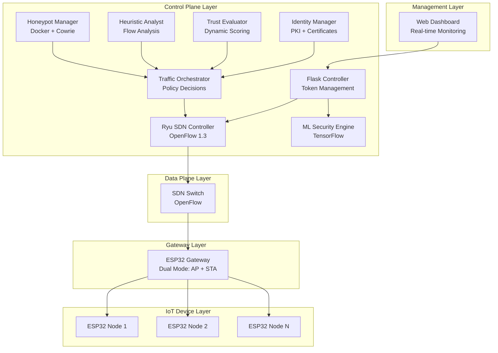

# SecureIoT-SDN - Complete Technical Guide

> **Comprehensive reference for architecture, features, implementation, and APIs**

## Table of Contents

1. [System Overview](#system-overview)
2. [Architecture](#architecture)
3. [Core Features & Implementation](#core-features--implementation)
4. [Novel Contributions](#novel-contributions)
5. [API Reference](#api-reference)
6. [Project Structure](#project-structure)

---

## System Overview

### What is SecureIoT-SDN?

**SecureIoT-SDN** is a comprehensive, enterprise-grade IoT security framework that combines Software-Defined Networking (SDN) with Zero Trust security principles. It provides advanced protection for IoT devices through multiple integrated security layers.

### Key Features

- 🔐 **Zero Trust Architecture**: Continuous verification with dynamic trust scoring (0-100)
- 🤖 **ML-Based Attack Detection**: Real-time DDoS detection using TensorFlow models
- 🌐 **SDN Policy Enforcement**: Dynamic OpenFlow rules with policy translation
- 📊 **Heuristic-Deception System**: Integrated anomaly detection with honeypot feedback loop
- 🔑 **PKI-Based Identity**: X.509 certificates with physical device binding
- 🎯 **Traffic Orchestration**: Multi-factor intelligent policy decisions
- 🐝 **Honeypot Integration**: Automated threat intelligence gathering
- 📈 **Real-Time Dashboard**: Network topology visualization and metrics

### Technology Stack

**Backend**: Python 3.8+, Flask 3.0+, TensorFlow 2.14+, Ryu 4.34+, SQLite3, Docker  
**Frontend**: HTML5/CSS3, JavaScript, vis-network.js  
**Hardware**: ESP32 microcontrollers, Raspberry Pi 4  
**Security**: cryptography, pyOpenSSL, X.509 PKI

---

## Architecture

### High-Level Architecture

The system is organized into five main layers:



### Layered Architecture

#### Layer 1: IoT Device Layer
- **ESP32 microcontrollers** with sensors
- WiFi connectivity (802.11 b/g/n)
- Token-based authentication
- Periodic data transmission (5s intervals)
- MAC address identification

#### Layer 2: Gateway Layer
- **ESP32 Gateway** in dual-mode (AP + STA)
- **AP Mode**: Creates "ESP32-AP" for nodes (192.168.4.0/24)
- **STA Mode**: Connects to controller network via WiFi/Ethernet
- Data forwarding between nodes and controller
- Protocol translation

#### Layer 3: Data Plane Layer
- **OpenFlow-compatible switch**
- Flow table management
- Policy enforcement (ALLOW/DENY/REDIRECT/QUARANTINE)
- Flow statistics collection (every 10s)
- Packet forwarding based on rules

#### Layer 4: Control Plane Layer

**Flask Controller** (`controller.py`)
- REST API endpoints
- Token generation and validation
- Device authorization management
- Rate limiting enforcement (60 packets/min)
- Dashboard serving

**Ryu SDN Controller** (`ryu_controller/sdn_policy_engine.py`)
- OpenFlow 1.3 protocol handling
- Policy translation from Identity module to OpenFlow rules
- Threat alert handling from Analyst module
- Dynamic rule installation
- Traffic redirection to honeypot

**ML Security Engine** (`ml_security_engine.py`)
- TensorFlow model loading
- Real-time packet analysis
- Attack detection (DDoS, Botnet, Flood)
- Confidence scoring

**Identity Manager** (`identity_manager/`)
- Certificate Authority (CA) management
- Device certificate generation (X.509)
- Physical identity linking (MAC + fingerprint)
- Behavioral baseline establishment
- Least-privilege policy generation

**Trust Evaluator** (`trust_evaluator/`)
- Dynamic trust score calculation (0-100)
- Device attestation (every 5 minutes)
- Policy adaptation based on trust thresholds
- Score history persistence

**Heuristic Analyst** (`heuristic_analyst/`)
- Flow statistics polling from switches
- Anomaly detection (DoS, scanning, volume attacks)
- Baseline comparison
- Alert generation

**Honeypot Manager** (`honeypot_manager/`)
- Cowrie honeypot deployment (Docker)
- Log parsing and analysis
- Threat intelligence extraction (IPs, commands)
- Mitigation rule generation

**Traffic Orchestrator** (`ryu_controller/traffic_orchestrator.py`)
- Intelligent policy decisions
- Multi-factor analysis (Identity + Trust + Threats)
- Dynamic enforcement

#### Layer 5: Management Layer
- **Web Dashboard** (Flask + HTML/CSS/JavaScript)
- Real-time network topology visualization
- Device management and authorization
- Security alerts and ML statistics
- Policy controls

### Component Interaction Diagram

```
┌─────────────────────────────────────────────────────────────┐
│              Zero Trust Integration Framework                │
└─────────────────────────────────────────────────────────────┘
         │              │              │              │
         ↓              ↓              ↓              ↓
┌──────────────┐ ┌──────────────┐ ┌──────────────┐ ┌──────────────┐
│   Identity   │ │    Trust     │ │  Heuristic   │ │   Honeypot   │
│   Manager    │ │  Evaluator   │ │   Analyst    │ │   Manager    │
└──────┬───────┘ └──────┬───────┘ └──────┬───────┘ └──────┬───────┘
       │                │                │                │
       │  Policy Defs   │  Trust Scores  │  Threat Alerts │  Threat Intel
       ↓                ↓                ↓                ↓
┌─────────────────────────────────────────────────────────────┐
│              Traffic Orchestrator                            │
│  • Intelligent Policy Decisions                              │
│  • Multi-factor Analysis (Identity + Trust + Threats)        │
└─────────────────────────────────────────────────────────────┘
       │                                                  │
       ↓                                                  ↓
┌──────────────┐                                  ┌──────────────┐
│   Ryu SDN    │                                  │   Flask      │
│  Controller  │ ←────────────────────────────→  │  Controller  │
└──────┬───────┘                                  └──────────────┘
       │
       ↓
┌──────────────┐
│  SDN Switch  │
│  (OpenFlow)  │
└──────────────┘
```

---

## Core Features & Implementation

### 1. Token-Based Authentication

**Purpose**: Secure device authentication with time-limited tokens

**Workflow**:
1. Device requests token with `device_id` and `mac_address`
2. Controller validates device authorization
3. UUID v4 token generated (5-minute session)
4. Each data packet must include valid token
5. Automatic token expiration and invalidation

**Configuration**:
```python
SESSION_TIMEOUT = 300  # 5 minutes in controller.py
RATE_LIMIT = 60  # packets per minute
```

**API**:
```bash
POST /get_token
{
    "device_id": "ESP32_2",
    "mac_address": "AA:BB:CC:DD:EE:FF"
}

Response: {"token": "550e8400-e29b-41d4-a716-446655440000"}
```

---

### 2. ML-Based DDoS Detection

**Purpose**: Real-time attack detection using machine learning

**Implementation**:
- Pre-trained TensorFlow models (CIC-DDoS2019 dataset)
- Features: packet size, protocol, ports, rates, TCP flags
- Attack types: Normal, DDoS, Botnet, Flood
- Confidence scoring and statistics tracking

**Models**:
- `models/ddos_model_retrained.keras` (recommended)
- 78 network features, deep neural network

**API**:
```bash
POST /ml/initialize        # Start ML engine
GET /ml/status            # Check status
GET /ml/detections        # Recent attacks
POST /ml/analyze_packet   # Analyze specific packet
```

---

### 3. SDN Policy Enforcement

**Purpose**: Dynamic network control via OpenFlow

**Policy Translation**:
The SDN Policy Engine receives high-level policies from Identity module and translates them to granular OpenFlow rules:

```python
# High-level policy from Identity module
policy = {
    'device_id': 'ESP32_2',
    'action': 'allow',
    'rules': [
        {'type': 'allow', 'match': {'ipv4_dst': '192.168.1.100'}, 'priority': 100},
        {'type': 'allow', 'match': {'tcp_dst': 80}, 'priority': 100},
        {'type': 'deny', 'match': {}, 'priority': 0}  # Default deny
    ]
}

# Translated OpenFlow rules:
# - Rule 1: Allow traffic from device MAC to 192.168.1.100
# - Rule 2: Allow TCP traffic from device MAC to port 80  
# - Rule 3: Deny all other traffic (least privilege)
```

**Policy Actions**:
- **ALLOW**: Normal forwarding
- **DENY**: Drop packet
- **REDIRECT**: Send to honeypot (port 3)
- **QUARANTINE**: Isolate device

**Threat Alert Handling**:
When Analyst module detects anomalies:
1. Alert sent to SDN Policy Engine via `handle_analyst_alert(device_id, alert_type, severity)`
2. OpenFlow rules dynamically installed to redirect traffic
3. Trust scores updated
4. Traffic orchestrator makes intelligent decisions

---

### 4. Zero Trust Architecture

**Components**:

**PKI-Based Identity**:
- Self-signed CA certificate
- X.509 device certificates
- Physical identity binding (MAC + device fingerprint)
- Certificate validation and revocation

**Continuous Attestation**:
- Runs every 5 minutes (configurable)
- Certificate validity check
- Heartbeat verification
- On failure: trust score -20, policy re-evaluated

**Dynamic Trust Scoring**:
- Score range: 0-100 (initial: 70)
- Persistent storage in identity database
- Immediate policy adaptation on score changes

**Score Adjustments**:
| Event | Adjustment | Trigger |
|-------|-----------|---------|
| Behavioral Anomaly (High) | -30 | Major traffic deviation |
| Behavioral Anomaly (Medium) | -15 | Moderate deviation |
| Behavioral Anomaly (Low) | -5 | Minor deviation |
| Attestation Failure | -20 | Certificate/heartbeat fail |
| Security Alert (High) | -40 | Critical threat |
| Security Alert (Medium) | -20 | Suspicious activity |
| Security Alert (Low) | -10 | Minor anomaly |

**Trust Thresholds**:
- **70-100**: ALLOW (Full access)
- **50-69**: REDIRECT (Monitored access)
- **30-49**: DENY (Limited access)
- **0-29**: QUARANTINE (Isolated)

---

### 5. Rate Limiting

**Configuration**:
- Default: 60 packets per minute per device
- 60-second sliding window
- Automatic blocking when exceeded

**Implementation**:
```python
# In controller.py
RATE_LIMIT = 60
packets_in_window = len([p for p in packet_timestamps 
                        if time.time() - p < 60])
if packets_in_window > RATE_LIMIT:
    return {"status": "rejected", "reason": "Rate limit exceeded"}
```

---

### 6. Real-Time Dashboard

**Features**:
- **Overview**: Network topology with vis-network.js
- **Devices**: Connected devices, authorization controls
- **Security**: SDN policies, alerts
- **ML Engine**: Attack detections, statistics
- **Analytics**: Performance metrics
- **Device Approval**: Pending device management

**Access**: `http://localhost:5000`

**Auto-refresh**: 5-second intervals via AJAX

---

## Novel Contributions

### 1. Policy Translation from Identity to OpenFlow

**Innovation**: Automatic translation of high-level, user-friendly policies into granular OpenFlow rules for least-privilege enforcement.

**Implementation** (`ryu_controller/sdn_policy_engine.py`):
```python
def apply_policy_from_identity(self, device_id, policy):
    """
    Translates high-level policy from Identity module to OpenFlow rules
    """
    # Get device MAC from Identity module
    device_info = self.identity_module.get_device_info(device_id)
    device_mac = device_info.get('mac_address')
    
    # Translate each policy rule to OpenFlow
    for rule in policy.get('rules', []):
        match_fields = {'eth_src': device_mac}
        match_fields.update(rule.get('match', {}))
        
        # Install OpenFlow rule on all switches
        self.apply_policy(device_id, rule['type'], match_fields, rule['priority'])
```

**Benefits**:
- Administrators define policies in business terms
- Automatic least-privilege enforcement
- Consistent policy application across switches
- Reduced human error

---

### 2. Heuristic-Deception Feedback Loop

**Innovation**: Tight integration of lightweight anomaly detection with active deception environment, creating an adaptive defense system.

**Complete Flow**:

```
1. Flow Statistics Polling (every 10s)
   ↓
2. Real-Time Anomaly Detection (compare vs baseline)
   ↓
3. Alert Generation (DoS, scanning, volume attacks)
   ↓
4. Policy Engine Alert Handler
   ↓
5. Traffic Redirection (OpenFlow rules → honeypot port)
   ↓
6. Honeypot Capture (Cowrie logs attacker interactions)
   ↓
7. Log Parsing (extract IPs, commands, patterns)
   ↓
8. Threat Intelligence Analysis
   ↓
9. Mitigation Rule Generation (DENY/REDIRECT/MONITOR)
   ↓
10. Rule Application (permanent mitigation)
    ↓
11. System Learns & Adapts
```

**Detection Rules**:
- **DoS**: Packet rate > 10x baseline
- **Volume Attack**: Byte rate > 10x baseline
- **Network Scanning**: Unique destinations > 5x baseline (min: 20)
- **Port Scanning**: Unique ports > 3x baseline (min: 10)

**Severity-Based Actions**:
- High (70+): DENY all traffic from attacker IP
- Medium (40-69): REDIRECT to honeypot for monitoring
- Low (20-39): MONITOR and log

**Key Innovation**: The heuristic analysis acts as a tripwire that triggers high-fidelity threat intelligence capture, which generates confirmed mitigation rules. System becomes more effective over time.

---

### 3. Traffic Orchestration Engine

**Innovation**: Single intelligent orchestration engine for dynamic policy decisions based on multiple real-time variables.

**Decision Factors**:
1. Device identity and authentication status
2. Current trust score (0-100)
3. Active threat intelligence from Analyst
4. Recent security alerts and severity
5. Threat level assessment (none/low/medium/high/critical)

**Decision Logic** (`traffic_orchestrator.py`):
```python
def orchestrate_policy(device_id, threat_intelligence):
    # Gather all factors
    device_info = get_device_info(device_id)
    trust_score = get_trust_score(device_id)
    recent_alerts = get_recent_alerts(device_id)
    threat_level = assess_threat_level(device_id, threat_intelligence)
    
    # Make intelligent decision
    if threat_level == 'critical':
        return 'QUARANTINE'
    elif threat_level == 'high' or trust_score < 30:
        return 'QUARANTINE'
    elif threat_level == 'medium' or trust_score < 50:
        return 'DENY'
    elif trust_score < 70:
        return 'REDIRECT'
    else:
        return 'ALLOW'
```

**Benefits**:
- Holistic security decisions
- Adaptive response to threats
- Audit trail of policy decisions
- Reduced false positives

---

### 4. Automatic Behavioral Profiling with Zero-Touch Policy Generation

**Innovation**: Devices automatically profiled during 5-minute onboarding period, with automatic baseline establishment and least-privilege policy generation.

**Workflow**:
1. Device onboarded → Certificate generated
2. Profiling starts (5 minutes)
3. SDN Policy Engine records all traffic
4. Traffic patterns analyzed (IPs, ports, protocols, packet sizes)
5. Behavioral baseline established automatically
6. Least-privilege policy generated from observed behavior
7. Policy applied to SDN controller
8. Continuous monitoring against baseline

**Finalization** (`device_onboarding.py`):
- Background monitoring thread checks every 30 seconds
- Auto-finalizes when profiling period expires
- Generates policies with default-deny rules
- No manual intervention required

---

## API Reference

### Authentication Endpoints

#### POST /get_token
Request authentication token.

**Request**:
```json
{
    "device_id": "ESP32_2",
    "mac_address": "AA:BB:CC:DD:EE:FF"
}
```

**Response (200)**:
```json
{
    "token": "550e8400-e29b-41d4-a716-446655440000"
}
```

**Response (403)**:
```json
{
    "error": "Device not authorized"
}
```

---

#### POST /data
Submit device data packet.

**Request**:
```json
{
    "device_id": "ESP32_2",
    "token": "550e8400-...",
    "timestamp": "1234567890",
    "data": "25.5",
    "size": 1500,
    "protocol": 6,
    "src_port": 12345,
    "dst_port": 80
}
```

**Response (Accepted)**:
```json
{
    "status": "accepted"
}
```

**Response (Rejected)**:
```json
{
    "status": "rejected",
    "reason": "Rate limit exceeded"
}
```

---

### Dashboard Endpoints

#### GET /get_data
Get device status and metrics.

**Response**:
```json
{
    "ESP32_2": {
        "packets": 150,
        "rate_limit_status": "45/60",
        "blocked_reason": null,
        "last_seen": 1234567890.0,
        "packets_per_minute": 45
    }
}
```

---

#### GET /get_topology_with_mac
Get network topology with MAC addresses.

**Response**:
```json
{
    "nodes": [
        {
            "id": "ESP32_2",
            "label": "ESP32_2",
            "mac": "AA:BB:CC:DD:EE:22",
            "online": true,
            "last_seen": 1234567890.0,
            "packets": 150
        }
    ],
    "edges": [
        {"from": "ESP32_2", "to": "ESP32_Gateway"}
    ]
}
```

---

#### GET /api/certificates
Get certificate statistics.

**Response**:
```json
{
    "total": 5,
    "valid": 4,
    "expiring_soon": 1,
    "expired": 0
}
```

---

### SDN Policy Endpoints

#### POST /toggle_policy/{policy}
Toggle SDN policy (packet_inspection, traffic_shaping, dynamic_routing).

**Response**:
```json
{
    "enabled": true
}
```

---

#### GET /get_policies
Get current policy states.

**Response**:
```json
{
    "packet_inspection": false,
    "traffic_shaping": true,
    "dynamic_routing": false
}
```

---

### ML Engine Endpoints

#### POST /ml/initialize
Initialize ML security engine.

**Response**:
```json
{
    "status": "success",
    "message": "ML engine initialized and monitoring started"
}
```

---

#### GET /ml/status
Get ML engine status and statistics.

**Response**:
```json
{
    "status": "active",
    "monitoring": true,
    "statistics": {
        "total_packets": 10000,
        "attack_packets": 150,
        "normal_packets": 9850,
        "attack_rate": 1.5,
        "detection_rate": 98.5
    }
}
```

---

#### GET /ml/detections
Get recent attack detections.

**Response**:
```json
{
    "status": "success",
    "detections": [
        {
            "timestamp": "2024-01-15T14:30:00",
            "is_attack": true,
            "attack_type": "DDoS Attack",
            "confidence": 0.95,
            "device_id": "ESP32_2"
        }
    ]
}
```

---

### Trust Score Endpoints

#### GET /api/trust_scores
Get trust scores for all devices.

**Response**:
```json
{
    "ESP32_2": {
        "trust_score": 85,
        "last_updated": "2024-01-15T14:30:00"
    }
}
```

---

## Project Structure

```
IOT-project/
│
├── controller.py                 # Main Flask controller
├── ml_security_engine.py         # ML attack detection
├── zero_trust_integration.py     # Framework orchestrator
├── mininet_topology.py           # Test topology (Mininet)
├── simple_ddos_detector.py       # Lightweight DDoS detector
├── requirements.txt              # Python dependencies
├── start.sh                      # Automated startup script
│
├── identity_manager/             # PKI & Identity Management
│   ├── certificate_manager.py   # CA and certificate operations
│   ├── identity_database.py     # SQLite device database
│   ├── device_onboarding.py     # Onboarding workflow
│   ├── behavioral_profiler.py   # Traffic profiling
│   └── policy_generator.py      # Policy generation
│
├── trust_evaluator/              # Trust Scoring
│   ├── trust_scorer.py          # Dynamic trust calculation
│   ├── device_attestation.py    # Continuous attestation
│   └── policy_adapter.py        # Trust-based policy adaptation
│
├── heuristic_analyst/            # Anomaly Detection
│   ├── flow_analyzer.py         # Flow statistics polling
│   ├── anomaly_detector.py      # Heuristic detection
│   └── baseline_manager.py      # Baseline management
│
├── honeypot_manager/             # Honeypot Integration
│   ├── docker_manager.py        # Docker operations
│   ├── honeypot_deployer.py     # Deployment
│   ├── log_parser.py            # Log parsing
│   ├── threat_intelligence.py   # Threat extraction
│   └── mitigation_generator.py  # Rule generation
│
├── ryu_controller/               # SDN Controller
│   ├── sdn_policy_engine.py     # Main Ryu application
│   ├── openflow_rules.py        # OpenFlow rule generation
│   ├── traffic_redirector.py    # Honeypot redirection
│   └── traffic_orchestrator.py  # Intelligent orchestration
│
├── network_monitor/              # Network Monitoring
│   ├── wifi_detector.py         # WiFi device detection
│   ├── device_id_generator.py   # Device ID generation
│   ├── pending_devices.py       # Approval workflow
│   └── auto_onboarding_service.py # Auto-onboarding
│
├── templates/                    # Web Dashboard
│   └── dashboard.html           # Main dashboard
│
├── esp32/                        # ESP32 Firmware
│   ├── gateway.ino              # Gateway (AP + STA)
│   └── node.ino                 # Node firmware
│
├── scripts/                      # Deployment Scripts
│   └── raspberry_pi_setup.sh   # Raspberry Pi deployment
│
├── docs/                         # Documentation
│   ├── README.md                # Project overview
│   ├── COMPLETE_GUIDE.md        # This file
│   ├── DEVICE_ONBOARDING.md     # Onboarding guide
│   ├── SECURITY_FEATURES.md     # Security mechanisms
│   └── DEPLOYMENT_GUIDE.md      # Deployment guide
│
├── certs/                        # Certificates (generated)
├── logs/                         # Log files
├── models/                       # ML models
├── data/                         # Runtime data
└── tests/                        # Test suite
```

---

## Configuration

### Controller Configuration

Edit `controller.py`:
```python
# Session timeout (seconds)
SESSION_TIMEOUT = 300

# Rate limiting
RATE_LIMIT = 60  # packets per minute

# Authorized devices
authorized_devices = {
    "ESP32_2": True,
    "ESP32_3": True
}
```

### Zero Trust Framework Configuration

Edit `zero_trust_integration.py`:
```python
config = {
    'flow_polling_interval': 10,     # Flow stats polling (seconds)
    'anomaly_window': 60,             # Anomaly detection window (seconds)
    'honeypot_type': 'cowrie',        # Honeypot type
    'initial_trust_score': 70,        # Initial trust score
    'attestation_interval': 300       # Attestation interval (seconds)
}
```

### Anomaly Detection Thresholds

Edit `heuristic_analyst/anomaly_detector.py`:
```python
DOS_THRESHOLD_HIGH = 10.0      # 10x baseline
DOS_THRESHOLD_MEDIUM = 5.0     # 5x baseline
SCAN_DEST_THRESHOLD = 5.0      # 5x baseline destinations
SCAN_PORT_THRESHOLD = 3.0      # 3x baseline ports
```

---

## License

MIT License - See LICENSE file for details

---

## References

- **NIST SP 800-207**: Zero Trust Architecture guidelines
- **OpenFlow 1.3**: SDN protocol specification
- **CIC-DDoS2019**: ML training dataset
- **Cowrie**: SSH/Telnet honeypot

---

**Last Updated**: 2026-01-02  
**Version**: 2.0
